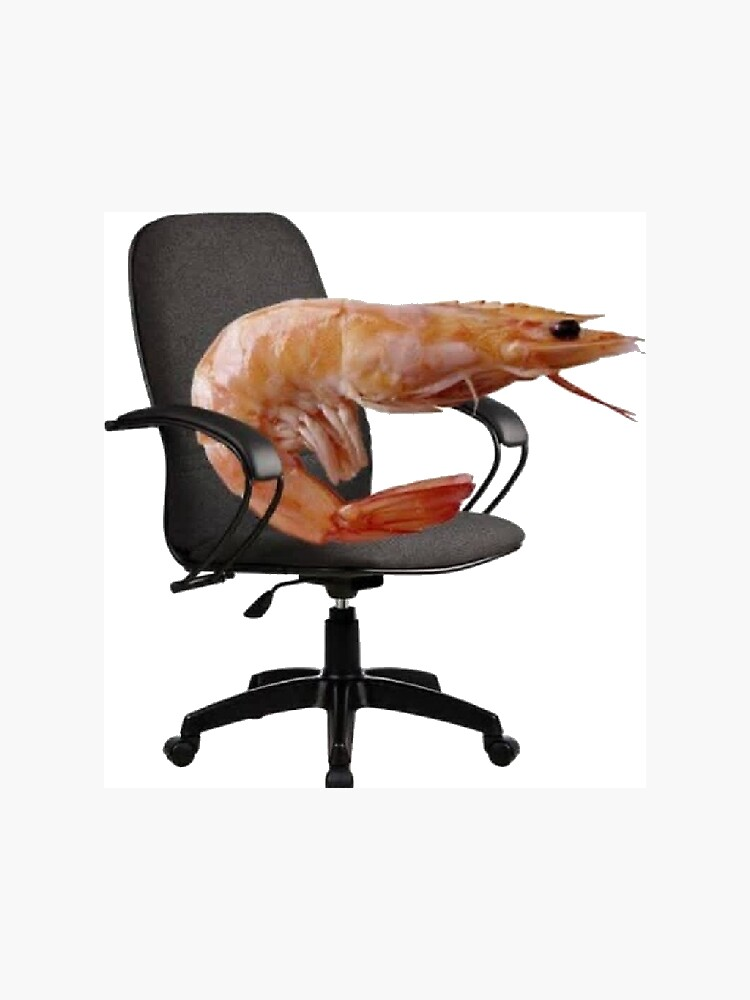

  <h1>Un Shrimp</h1>
  
<strong>Chrome computer vision posture monitor for real-time seated posture feedback.</strong>

  
  

    <code>Chrome Extension</code> |
    <code>Webcam Pose Estimation</code> |
    <code>Posture Feedback</code>
  

## About The Project

UnShrimp is a locally running Chrome extension that uses a laptop webcam to monitor seated posture in real time. This project focuses on detecting a user's poor posture while using their computer, and providing them actionable feedback.

The preliminary version focuses on the browser-based posture monitoring flow: open a monitor page, request webcam access, run pose estimation locally, draw body landmarks and  skeleton overlays, calibrate the user's normal sitting posture, detect sustained poor posture, and provide useful feedback in real-time.

All processing runs locally in the browser.

## Seated Posture Scope

UnShrimp is designed for seated desk posture while someone is working on a laptop or desktop. The project is not intended for standing posture, classifying a full-body pose, tracking exercise form, or providing medical diagnosis or treatment.

For data collection and the final demo, the camera should focus on seated upper-body posture:

| Framing Need | Rule |
| --- | --- |
| Required | Head, face or nose area, both shoulders, and upper torso should be visible. |
| Recommended | Waist or hip line should be visible if the laptop camera naturally captures it. |
| Not Required | Legs, knees, ankles, feet, or full-body standing view. |

This keeps the dataset realistic for normal webcam use. 

## Dataset And V1 Model Input

The project does not train pose estimation. MediaPipe provides body landmarks, and UnShrimp trains a posture classifier from those landmark values and engineered posture features.

For v1 training:

- Full JSON exports retain all 33 MediaPipe landmarks for debugging and future use.
- The main training CSV uses only upper-body seated landmarks: nose, eyes, ears, mouth points, left shoulder, and right shoulder.
- Lower-body and hands are excluded from the v1 training CSV.
- The training CSV uses shoulder-normalized landmark coordinates and finite upper-body posture features.
- Train/validation/test splitting is handled in Python preparation scripts, not by the browser export.

This keeps the model aligned with the Chrome extension's use-case: seated laptop webcam posture monitoring.

## Locked Final Demo Goal

The first demo should:

1. Open a monitoring page.
2. Request webcam permission.
3. Show the live webcam feed.
4. Run pose estimation locally in the browser.
5. Draw body landmarks and skeleton overlay.
6. Allow user to calibrate their normal sitting posture.
7. Detect sustained poor posture.
8. Show posture status, posture score, and warning message.
9. Alert only after bad posture persists for a few seconds.

## Locked Posture Classes

Use only these posture states for the first demo:

| Posture State | Definition |
| --- | --- |
| `good_posture` | User remains close to their calibrated normal posture. |
| `shrimp_slouch` | User positioned with a rounded or collapsed forward sitting posture (shrimp-like positioning) |
| `forward_lean` | User is leaning toward the screen. |
| `looking_down` | User head or face is angled downward toward keyboard, phone, or desk. |
| `uncertain` | Pose cannot be trusted because landmarks are missing, confidence is low, or the user is partially out of frame. |

## Git Workflow

- Keep the main branch stable and demo-ready.
- Use a development branch for active integration work.
- Create feature branches for isolated tasks or fixes.
- Keep commits focused and descriptive
- Test changes locally before merging into the stable branch.
- Avoid unrelated changes in the same commit.
- Use pull requests or reviewed merges when collaborating.
